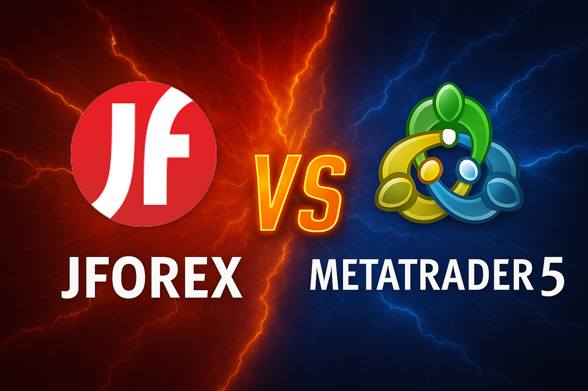

Недавно пришлось изучить торговый терминал JForex 4 от [dukascopy.com](https://dukascopy.com) при разработке одной торговой стратегии, основанной на свечах Renko. Это мой первый опыт работы с этим терминалом, поэтому некоторые выводы могут оказаться неверными. В любом случае хочу поделиться недостатками и достоинствами JForex 4 в сравнении с MetaTrader 5.

## TLDR
JForex - современный кроссплатформенный терминал, со встроенным исполнением стратегий в облаке, с мощным инструментарием Java для разработки, но слабым комьюнити и фактическим вендерлоком на одного брокера.

## Достоинства

**1. Кроссплатформенность**. JForex 4 на MacOS работает без виртуализации, потому что терминал написан на Java.
**2. Доступная история и котировки Level 2 от dukascopy из коробки.**
**3. Гибкие графики:** 
    - по Bid или по Ask;
    - Renko;
    - и многие другие.
**4. JCloud**. Терминал может запускать боты как локально, так и в облаке брокера. Эта функция встроена в терминал.
**5. Мультисессионный тестинг**. В отличии от MT5 JForex может одновременно запустить тесты стратегии на нескольких инструментах и с несколькими наборами параметров, получая сквозную аналитику.
**6. Мощь Java**. Хоть Java и имеет более высокий порог входа для разработчиков, она позволяет строить куда более сложные решения, использую гигантский набор уже готовых фреймворков и библиотек Java.
**7. Красивый современный интерфейс**. Не в пример визуально допотопному MT5.

## Недостатки

**1. Фактически вендорлок на одного брокера dukascopy.**
**2. Без интернета не работает:** 
    - Открыть терминал без интернета нельзя, даже чтобы просто открыть исторические графики без торговли.
    - Без интернета тестер тоже не работает, поэтому отладка стратегии даже на скаченной истории невозможна.
**3. Тестер сильно тормозит.** Часами скачивает тиковую историю без визуального прогресса, поэтому понять завис ли он окончательно или что-то делает невозможно. Пришлось ждал целую ночь, чтобы скачать тиковую историю одного инструмента.
**4. Тестер глючит**. В визуальном режиме часто зависает наглухо, особенно при использовании тиковых ботов.
**5. Тестер неудобный и малофункциональный**, особенно визуальный режим: 
    - нет точной паузы в нужный момент;
    - нет перемотки до нужных моментов времени;
    - нет пошагового режима: по тикам или по барам;
    - нет списка текущих позиций с их параметрами на текущий момент;
**6. Малофункциональная IDE**. Даже функционально допотопная IDE MetaTrader 5 сильно опережает встроенную в JForex. Самая большая проблема - это невозможность дебага. Хотя на Java можно разрабатывать в любой другой современной IDE, но без брейкпоинтов и дебагинга, запущенной в терминале стратегии. Увы.
**7. Менее развитое комьюнити и маркет**. Да, MetaQuotes построила огромное международное сообщество и маркет решений, и пока JForex до них далеко.

